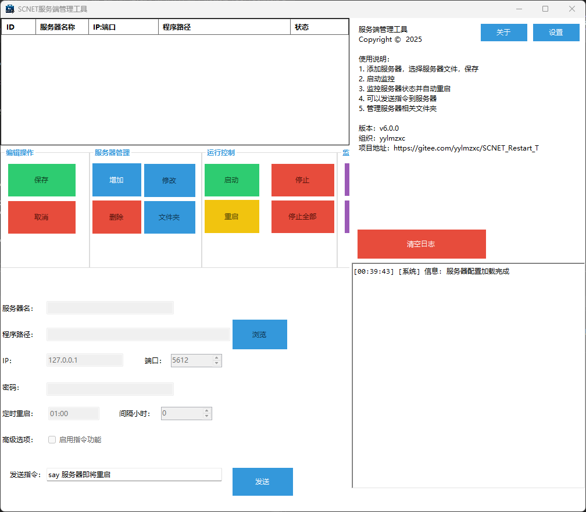

# SCNET_Restart_Tool

## 项目简介

SCNET_Restart_Tool 是一款专为 SCNET 服务端程序（如生存战争服务器）设计的高级监控与自动重启工具。该工具通过实时监控服务运行状态，提供多种智能重启机制和远程控制功能，确保服务端程序持续稳定运行，最大限度减少人工干预，提高服务可用性和运维效率。



## 核心功能特性

### 多服务器管理
- 支持同时配置和管理多个服务端实例
- 每个服务器可独立设置监控参数和重启策略
- 直观的列表界面展示所有服务器运行状态和基本信息

### 智能故障检测与自动重启
- 实时监控指定服务进程状态，支持进程名+路径双重验证机制
- 服务意外终止时自动执行重启操作，确保服务连续性
- 内置智能重试机制，应对启动失败的情况
- 详细的操作日志记录，便于问题追溯和系统分析

### 灵活的重启计划策略
- **定时计划重启**：支持设置每日固定时间点自动重启服务
- **间隔周期重启**：可按设定的时间间隔（小时）自动重启服务
- 重启前可发送优雅关闭指令，确保服务正常终止
- 重启倒计时提示，便于用户了解系统状态变更

### 远程命令控制系统
- 提供 TCP 协议接口，可远程向服务端发送自定义命令
- 支持命令发送前的密码验证，保障系统安全性
- 实时显示命令执行结果，便于远程操作监控

### 便捷的文件夹管理
- 集成服务器相关文件夹快速访问功能
- 支持直接打开配置、日志、插件、模组、纹理、世界等常用文件夹
- 提供图标化的文件夹操作界面，提高管理效率

### 完善的日志系统
- 实时记录所有操作和状态变更
- 支持日志文件保存，便于后期查阅和分析
- 可自定义日志保存路径和记录级别

### 程序自检与权限管理
- 自动检测管理员权限，确保程序正常运行
- 提供权限提升选项，避免因权限不足导致功能受限

### 跨平台支持
- Windows 版本：提供友好的图形用户界面，操作简便直观
- Linux 版本：命令行界面，适合服务器环境后台运行

## 技术架构

### 开发技术栈
- **开发语言**：C#
- **框架**：.NET 10.0 (Windows版) / .NET 10.0 (Linux版)
- **GUI框架**：Windows Forms (Windows版)
- **网络通信**：Socket TCP/IP
- **进程管理**：System.Diagnostics、WMI
- **配置管理**：XML配置文件序列化
- **日志系统**：自定义 LogManager 组件

### 主要组件说明

1. **ToolMain.cs** (`界面/Main/`)
   - Windows 版的主窗体界面和核心逻辑
   - 管理多个服务器配置和监控器实例
   - 处理用户交互、配置管理和功能调度

2. **ServerMonitor.cs**
   - 服务器监控的核心组件
   - 实现进程监控、自动重启、定时任务等功能
   - 提供进程检测、启动、停止和命令发送接口

3. **ServerConfig.cs**
   - 服务器配置的数据结构定义
   - 包含服务器基本信息、监控参数和运行状态
   - 提供服务器相关文件夹路径的便捷访问方法

4. **LogManager.cs**
   - 日志管理组件，采用单例模式设计
   - 支持实时日志显示和文件保存功能
   - 支持不同日志级别（信息、警告、错误、调试）的区分处理

5. **ServerStatus.cs**
   - 服务器状态枚举和状态管理类
   - 定义服务器运行的各种状态及其转换逻辑

6. **FolderManagerForm.cs** (`界面/FolderManagerCode/`)
   - 文件夹管理界面和操作逻辑
   - 提供服务器相关文件夹的快速访问功能

7. **SettingsForm.cs** (`界面/Settings/`)
   - 程序全局设置界面
   - 允许用户配置日志、权限等全局选项

## 安装与配置

### 系统要求
- **Windows 版**：Windows 10/11，安装 .NET 10.0 Runtime 或更高版本
- **Linux 版**：支持 .NET 10.0 的 Linux 发行版（如 Ubuntu 22.04+, CentOS 9+ 等）
- **硬件要求**：最小系统资源（CPU: 1GHz+, 内存: 512MB+）

### Windows 版安装步骤
1. 确保系统已安装 .NET 10.0 Runtime 或更高版本
2. 下载编译好的可执行文件或使用 Visual Studio 编译源代码
3. 直接运行可执行文件或创建快捷方式以便访问
4. 首次运行程序时，系统会自动检查管理员权限，确保程序正常运行

### Linux 版安装步骤
1. 确保系统已安装 .NET 10.0 Runtime
2. 下载编译好的 Linux 版本可执行文件或从源代码编译
3. 授予可执行权限并通过命令行运行
4. 根据提示配置监控选项、重启间隔等参数

## 配置指南

### 服务器基本配置
1. 在主界面点击「添加服务器」按钮
2. 填写服务器名称、服务器程序路径和进程名
3. 设置监控参数：检测间隔、重启超时时间等
4. 配置重启策略：定时重启或间隔重启
5. 保存配置设置

### 远程命令设置
1. 在服务器配置中启用远程命令功能
2. 设置通信端口和访问密码
3. 配置允许的命令列表
4. 保存设置并应用

### 全局设置
1. 点击「设置」按钮进入全局设置界面
2. 配置日志保存路径和记录级别
3. 设置程序启动选项（如开机自启）
4. 配置界面主题和显示选项

## 使用指南

### 基本操作流程
1. **添加服务器**：点击「添加服务器」按钮，填写服务器信息
2. **启动监控**：选择已配置的服务器，点击「开始监控」按钮
3. **查看状态**：在主界面实时查看服务器运行状态和日志
4. **远程控制**：使用远程命令功能发送指令到服务器
5. **管理文件夹**：点击「文件夹管理」按钮，快速访问服务器相关目录

### 定时重启设置
1. 选择要配置的服务器
2. 启用「定时重启」功能
3. 设置每日重启时间点（可设置多个）
4. 配置重启前是否发送关闭指令及等待时间

### 间隔重启设置
1. 选择要配置的服务器
2. 启用「间隔重启」功能
3. 设置重启间隔时间（小时）
4. 配置重启前的准备操作

### 查看日志
1. 点击主界面上的「日志」标签页
2. 查看实时日志记录
3. 可按日志级别筛选显示内容
4. 点击「导出日志」按钮保存日志文件

## 项目结构

```
SCNET_Restart_Tool/
├── 界面/                  # 用户界面相关代码
│   ├── About/             # 关于对话框
│   ├── FolderManagerCode/ # 文件夹管理相关代码
│   ├── Main/              # 主界面代码
│   └── Settings/          # 设置界面代码
├── Res/                   # 资源文件
│   └── png/               # 图标图片资源
├── App.config             # 应用程序配置
├── LogItem.cs             # 日志项数据结构
├── LogManager.cs          # 日志管理类
├── ProcessHelper.cs       # 进程操作辅助类
├── Program.cs             # 程序入口点
├── ServerConfig.cs        # 服务器配置类
├── ServerConfigManager.cs # 服务器配置管理类
├── ServerMonitor.cs       # 服务器监控核心类
├── ServerStatus.cs        # 服务器状态枚举类
├── SCNET_Restart_Tool.csproj # 项目文件
└── SCNET_Restart_Tool.sln # 解决方案文件
```

## 注意事项

1. **管理员权限**：程序需要管理员权限才能正确监控和管理系统进程，请确保以管理员身份运行
2. **配置文件备份**：建议定期备份程序配置文件，以防止配置丢失
3. **网络安全**：使用远程命令功能时，请确保设置强密码并限制访问IP
4. **日志管理**：定期清理日志文件，避免占用过多磁盘空间
5. **系统兼容性**：Windows 版本需要 .NET 10.0 Runtime，Linux 版本需要 .NET 10.0 Runtime

## 常见问题解答

**Q: 程序无法检测到服务器进程怎么办？**
A: 请检查服务器程序路径和进程名是否正确，确保服务器程序确实在运行中。

**Q: 定时重启功能不生效是什么原因？**
A: 请检查系统时间是否准确，以及定时重启设置是否正确保存。

**Q: 如何让程序随系统启动自动运行？**
A: 在全局设置中启用「开机自启」选项，或手动将程序快捷方式添加到系统启动项。

## 更新日志

### v1.1.0
- 项目框架升级至 .NET 10.0，Windows 版与 Linux 版统一使用 .NET 10.0 Runtime
- System.Management 依赖包同步升级至 10.0.0

### v1.0.0
- 初始版本发布
- 实现基本的服务器监控和自动重启功能
- 支持多服务器管理
- 提供Windows图形界面版本

## 许可证

该项目采用 MIT 许可证 - 详情请查看 LICENSE 文件

## 联系我们

如有问题或建议，请通过以下方式联系我们：
- 项目维护者：[项目维护者名称]
- 反馈邮箱：[反馈邮箱地址]
- GitHub仓库：[GitHub仓库链接]

1. **Windows 版安装**
   - 从发布页面下载最新版本的 `SCNET_Restart_Tool.zip`
   - 解压到任意目录
   - 右键点击 `SCNET_Restart_Tool.exe`，选择「以管理员身份运行」启动程序
   - 如需开机自启，可创建快捷方式并放入启动文件夹

2. **Linux 版安装**
   - 从发布页面下载最新版本的 `LinuxRestartTool.zip`
   - 解压到目标目录
   - 安装 .NET 10.0 Runtime：`sudo apt-get install -y dotnet-runtime-10.0`（Ubuntu/Debian）
   - 运行程序：`dotnet LinuxRestartTool.dll`
   - 如需后台运行，可使用 systemd 服务配置或 nohup 命令

### 配置说明

#### Windows 版配置
1. **服务器基本配置**
   - 点击「新增服务器」按钮
   - 填写服务器名称、程序路径（可通过「浏览文件」选择）
   - 设置服务器 IP 和端口（用于命令发送）
   - 如需密码验证，可设置访问密码

2. **重启策略配置**
   - **定时重启**：设置每日重启时间（格式：HH:MM）
   - **间隔重启**：设置间隔小时数（0表示禁用）
   - **命令功能**：勾选启用命令功能，允许发送指令到服务端

3. **保存配置**
   - 点击「保存配置」按钮，配置将自动保存到程序目录下的 `ServerConfigs.xml` 文件中
   - 下次启动程序时，配置将自动加载


```

## 使用指南

### Windows 版使用
1. **服务器管理**
   - 启动程序后，点击「新增服务器」添加新的服务端配置
   - 选择服务器后，可点击「编辑服务器」修改配置或「删除服务器」移除配置
   - 服务器列表会显示所有配置的服务器及其当前状态

2. **服务控制**
   - 选择服务器后，点击「启动服务器」手动启动服务
   - 点击「停止服务器」手动停止服务
   - 点击「重启服务器」手动重启服务
   - 点击「停止所有服务器」可一次性停止所有运行中的服务器

3. **监控管理**
   - 选择服务器后，点击「开启监控」开始自动监控服务状态
   - 监控开启后，程序会自动检测服务状态并在服务终止时自动重启
   - 点击「关闭监控」停止自动监控

4. **文件夹管理**
   - 选择服务器后，点击「文件夹管理」可快速访问服务器相关文件夹
   - 支持直接打开配置、日志、插件等常用目录

5. **命令发送**
   - 在编辑模式中启用命令功能
   - 在命令输入框中输入命令，点击「发送指令」发送到服务端
   - 程序会显示命令执行的响应结果


### 远程命令使用
Windows 版本中，可直接通过界面的命令输入框发送命令到服务端。常见命令示例：
- `close 9 例行维护`：正常关闭服务端（带维护消息）
- 其他自定义命令可根据服务端支持的命令进行发送

## 常见问题解答

**Q: 程序启动时提示需要管理员权限？**
A: 由于程序需要监控和管理系统进程，建议以管理员身份运行程序以确保功能正常。

**Q: 监控程序能够检测到服务崩溃，但无法自动重启？**
A: 请检查以下几点：
   - 服务端程序路径是否正确
   - 程序是否以管理员身份运行
   - 目标服务端程序是否存在权限问题

**Q: 如何修改日志保存路径？**
A: 点击界面右上角的「设置」按钮，在设置界面中可自定义日志保存路径。

**Q: 如何配置开机自启？**
A: Windows 系统中，可创建程序快捷方式并放入启动文件夹；Linux 系统中，建议配置 systemd 服务。

**Q: Linux 版本支持多个服务器配置吗？**
A: 目前 Linux 版本仅支持单个服务器配置，如需监控多个服务器，请运行多个实例。

**Q: 程序配置文件保存在哪里？**
A: Windows 版配置保存在程序目录下的 `ServerConfigs.xml`；Linux 版配置保存在程序目录下的 `default_program.config`。

## 开发与贡献

### 开发环境搭建
1. 安装 Visual Studio 2022 或更高版本
2. 克隆项目代码
3. 打开 `SCNET_Restart_Tool.sln` 解决方案文件
4. 还原 NuGet 包：`dotnet restore`
5. 构建解决方案：`Build > Build Solution`

### 项目结构
- `SCNET_Restart_Tool`：Windows 主项目
  - `界面`：包含所有 Windows 表单和用户界面
  - `Res`：包含图标和资源文件
- `LinuxRestartTool`：Linux 命令行版本

### 核心功能开发
- 如需扩展监控功能，请修改 `ServerMonitor.cs`
- 如需添加新的界面元素，请修改 `ToolMain.cs` 和对应的设计器文件
- 如需添加新的配置项，请修改 `ServerConfig.cs`

### 贡献指南
1. Fork 本项目仓库
2. 创建您的特性分支
3. 提交您的更改
4. 推送到分支
5. 提交 Pull Request

## 更新日志

### 主要更新
- 优化了进程检测逻辑，使用进程名+路径双重验证提高准确性
- 增加了自动重试机制，确保服务可靠启动
- 改进了日志系统，支持不同日志级别和文件保存
- 优化了用户界面，提供更直观的操作体验
- 修复了权限相关问题，确保程序在各种环境下正常运行

## 许可证

本项目采用 MIT 许可证。详情请查看项目中的 LICENSE 文件。

## 免责声明

本工具仅供学习和参考使用，使用本工具时请确保遵守相关法律法规。对于因使用本工具而导致的任何直接或间接损失，作者不承担任何责任。

---

如有任何问题或建议，请提交 Issue 至本项目的 Gitee 页面。